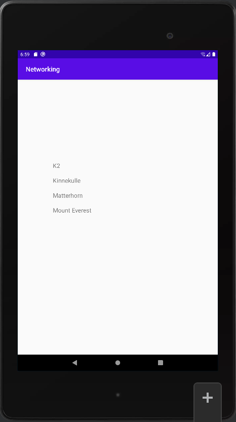

# Rapport


Skapar `ArrayList<Mountain>` som en variabel i MainActivity. Denna variabel håller bergen och skapas
med instanser av klassen Mountain.
```
    private final ArrayList<Mountain> items = new ArrayList<>();
```

Skapar variabeln adapter till `RecyclerViewAdapter`.
```
    private RecyclerViewAdapter adapter;
```

Instansierar en RecyclerViewAdapter och en ViewHolder klass med variabler och metoder för att sköta
recycler viewns funktionalitet. Här 
```
public static class RecyclerViewAdapter extends RecyclerView.Adapter<RecyclerViewAdapter.ViewHolder> {

    private final List<Mountain> items;
    private final LayoutInflater layoutInflater;
    private final OnClickListener onClickListener;

    RecyclerViewAdapter(Context context, List<Mountain> items, OnClickListener onClickListener) {
        this.layoutInflater = LayoutInflater.from(context);
        this.items = items;
        this.onClickListener = onClickListener;
    }

    @Override
    @NonNull
    public ViewHolder onCreateViewHolder(@NonNull ViewGroup parent, int viewType) {
        return new ViewHolder(layoutInflater.inflate(R.layout.recyclerviewitem, parent, false));
    }

    @Override
    public void onBindViewHolder(ViewHolder holder, int position) {
        holder.title.setText(items.get(position).toString());
    }

    @Override
    public int getItemCount() {
        return items.size();
    }

    public class ViewHolder extends RecyclerView.ViewHolder implements View.OnClickListener {
        TextView title;

        ViewHolder(View itemView) {
            super(itemView);
            itemView.setOnClickListener(this);
            title = itemView.findViewById(R.id.title);
        }

        @Override
        public void onClick(View view) {
            onClickListener.onClick(items.get(getAdapterPosition()));
        }
    }

    public interface OnClickListener {
        void onClick(Mountain item);
    }
}
```

När datan hämtas körs funktionen onPostExecute(). Funktionen skapar ett Gson objekt och omvandlar 
med hjälp av Gson JSON strängen till ett JSON objekt och skapar instanser av Mountain klassen.
Dessa används sedan i adaptern. Adaptern uppdaterad med notifyDataSetChanged metoden på adaptern. 

```
public void onPostExecute(String json) {
    Log.d("MainActivity", json);

    Gson gson = new Gson();
    Type type = new TypeToken<List<Mountain>>() {
    }.getType();
    ArrayList<Mountain> items = gson.fromJson(json, type);

    adapter = new RecyclerViewAdapter(this, items, item -> Toast.makeText(MainActivity.this, item.toString(), Toast.LENGTH_SHORT).show());
    adapter.notifyDataSetChanged();

    RecyclerView view = findViewById(R.id.recyclerview);
    view.setLayoutManager(new LinearLayoutManager(this));
    view.setAdapter(adapter);
}
```

URL variabeln ändras till webbservicens webbadress och internet tillåts.

Mounutainklassen skapas, övers är variablerna, sedan kommer konstruktorn och slutligen metoden som 
används för att skriva ut namnet på berget i recycler viewn:
```
public class Mountain {
    private String name;
    private String location;
    private int height;

    public Mountain(String inName, String inLocation, int inHeight){
        name = inName;
        location = inLocation;
        height = inHeight;
    }

    @Override
    public String toString(){
        return name;
    }
}
```



